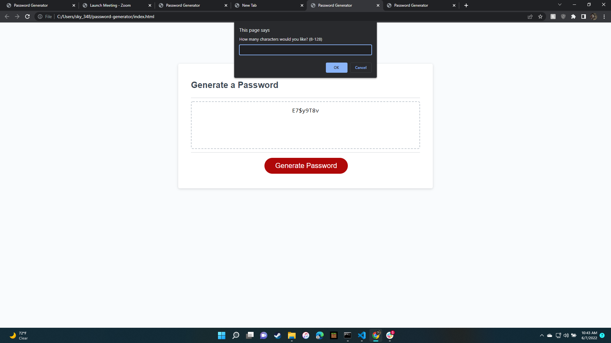

javascript password generator
image of deployed web page

image of password length prompt

image of upper case prompt

image of lower case prompt

image of number characters prompt

image of special characters prompt

link to webpage

link to github
